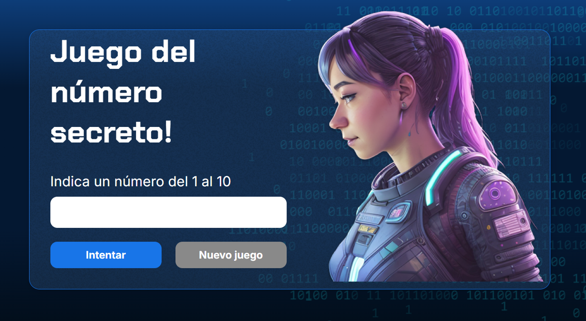

# **_🎮JUEGO DEL NUMERO SECRETO🎮_**

## 📑 **Índice**

- [**_🎮JUEGO DEL NUMERO SECRETO🎮_**](#juego-del-numero-secreto)
  - [📑 **Índice**](#-índice)
  - [📂Estructura de archivos](#estructura-de-archivos)
  - [🖼️ Vista previa del juego](#️-vista-previa-del-juego)
  - [🎯 Objetivo del proyecto:](#-objetivo-del-proyecto)
  - [📚 Nombre de las varibles y funciones:](#-nombre-de-las-varibles-y-funciones)
    - [📝\* *Variables*\*](#-variables)
    - [🛠️ **Funciones**](#️-funciones)
  - [✏️ Cambiar nombres de variables y funciones:](#️-cambiar-nombres-de-variables-y-funciones)
  - [💡 **Posibles Mejoras**](#-posibles-mejoras)
  - [🌐 **Conecta conmigo**](#-conecta-conmigo)
    - [💼 Mi LinkedIn](#-mi-linkedin)
  - [🛠 **Tecnologías usadas**](#-tecnologías-usadas)

## 📂Estructura de archivos
```bash
/juego-numero-secreto
│── /img
│   └── logo.png
│   └── bg.png
│   └── ia.png
│   └── numero-secreto-captura.png
│   └── Ruido.png
│── index.html
│── style.css
│── script.js
└── README.md
```
## 🖼️ Vista previa del juego


## 🎯 Objetivo del proyecto:
  
* [x] **OBJETICO PRINCIPAL** de este juego es adivinar un número secreto entre 1 y un numero maximo. El jugador tiene un número limitado de intentos para adivinar el número correcto. Cada vez que el jugador hace un intento, el juego le indica si su intento es un numero mayor o menor.

* [x] **SEGUNDO OBJETIVO** es que puedas cambiar los nombres de las variables y funciones a español, para que puedas entender mejor el código y adaptarlo a tus necesidades.

* [x] **TERCER OBJETIVO** es que puedas practicar el uso de variables y funciones en otro idioma, para que puedas mejorar tus habilidades de programación y comprensión del código.

## 📚 Nombre de las varibles y funciones:

### 📝* *Variables**

|       Ingles      |       Español         |
|-------------------|---------------------  |
|secretNumber       |numeroSecreto          |
|attempts           |intentos               |
|drawNumbers        |listaNumerosSorteados  |
|maxNumber          |numeroMaximo           |
|userInput          |numeroDeUsuario        |
|generatedNumber    |numeroGenerado         |
|text               |texto                  |
|selector           |elemento               |
|htmlElement        |elementoHTML           |

### 🛠️ **Funciones**

|          Ingles           |              Español              
|---------------------------|---------------------------|
|initialConditions()        |condicionesIniciales()     |
|setTextToElement()         |asignarTextoElemento()     |
|resetGame()                |reiniciarJuego()           |
|checkUserGuess()           |verificarIntento()         |
|generateSecretNumber()     |generarNumeroSecreto()     |
|clearInput()               |limpiarCaja()              |

## ✏️ Cambiar nombres de variables y funciones:
Si quieres cambiarlas selecciona la primera palabra y presiona **ctrl + d** para seleccionar todas las palabras iguales cuantas veces aparezcan, luego escribe el nuevo nombre y luego presiona **esc** para salir del modo de selección múltiple.

>⚠️Ten cuidado al seleccionar, porque si tienen el mismo nombre en otro contexto, lo cambiará también,incluso si no es una variable o funcion con el mismo nombre.⚠️


---

## 💡 **Posibles Mejoras**
Lista de ideas para seguir ampliando el proyecto.  

```markdown
Mejoras futuras
- [ ] Permitir elegir el rango de números antes de empezar.
- [ ] Agregar un contador de partidas ganadas y perdidas.
- [ ] Incluir sonidos al acertar o fallar.
- [ ] Cambiar colores dinámicamente según pista.
```
## 🌐 **Conecta conmigo**
### 💼 Mi LinkedIn

[](https://www.linkedin.com/in/michelle-montoya-alvarado-792812237/)


## 🛠 **Tecnologías usadas**


